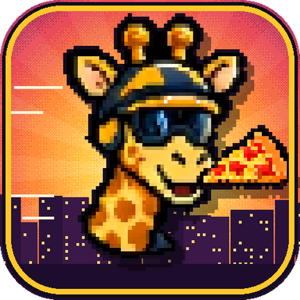
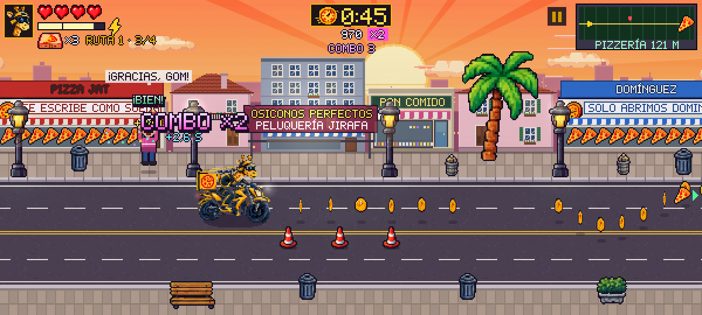
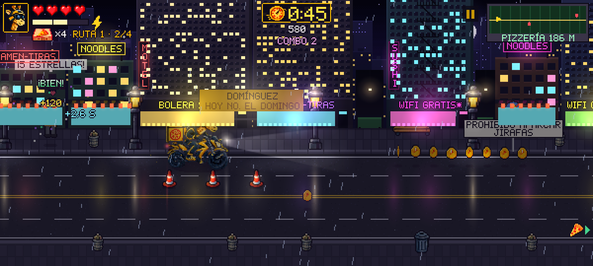
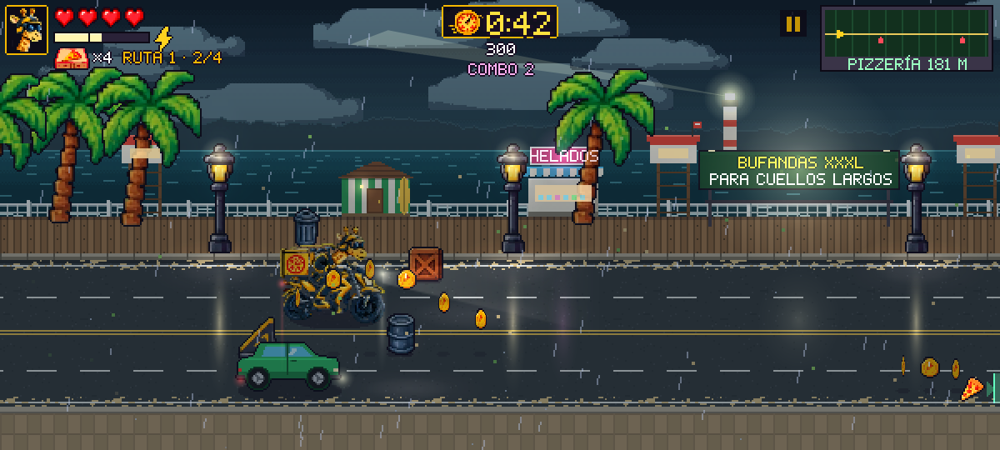

# GOM Pizza Delivery 🦒🍕

*Infinite runner* arcade en pixel art 16 bits: GOM, una jirafa motera, reparte pizzas por una
avenida **infinita y aleatoria** que cruza tres barrios (Avenida Atardecer, Distrito Neón y
Costa Tormenta), esquivando tráfico, peatones pegados al móvil, furgonetas de la competencia
**Pizza Rápida** y gaviotas con antecedentes.





- **Diseño completo (GDD):** [`docs/GDD.md`](docs/GDD.md)
- **APK para Android:** [`dist/GOM-Pizza-Delivery.apk`](dist/GOM-Pizza-Delivery.apk)
- **Arte de concepto original:** [`docs/concept/`](docs/concept/)
- **Música:** «Pizza Delivery 8-bit», de **saltamontesenelpelo** (`game/assets/music/`). Suena en
  bucle con fundido cruzado, baja de volumen en menús y pausa, y se acelera en la Pizza Fever y
  cuando quedan menos de 10 segundos. Los efectos de sonido se sintetizan en tiempo real.
- **Icono de la app:** adaptativo para Android 8+ (fondo de rayos de atardecer, GOM en pixel art
  mordiendo una porción y capa monocroma para los iconos temáticos de Android 13+), con versión
  clásica y de 512 px en [`docs/icono/`](docs/icono/). Se regenera con `python3 tools/make_icons.py`.

## Cómo se juega

Llevas pizzas en la caja térmica. Cada cliente espera en una acera (o asomado a una ventana)
con una **zona de entrega** brillante en el carril de al lado: colócate en ese carril y **lanza**
cuando pases por la franja dorada para un **PERFECTO**. Cada entrega suma puntos, combo y
segundos al reloj. Al final de cada ruta hay una **Pizzería de Recarga** que te rellena la caja,
te da tiempo extra y te lleva a un barrio nuevo. La partida acaba si te quedas sin corazones o
sin tiempo.

| Acción | Móvil (horizontal) | Teclado |
|---|---|---|
| Cambiar de carril | Joystick izquierdo ↑ ↓ | ↑ ↓ / W S |
| Acelerar / frenar | Joystick izquierdo → ← | → ← / D A |
| Lanzar pizza | Botón **LANZAR** (o cualquier toque a la derecha) | Espacio / J |
| Turbo Mozzarella | Botón del rayo | Shift / K |
| Salto (mejora del garaje) | Botón de la rampa | C / L |
| Cañón de pizzas (mejora) | Botón de la caja | V |
| Pausa | Botón «II» · botón atrás de Android | P / Esc |

Trucos: rozar vehículos sin chocar carga el turbo; en el aire (rampas) las entregas valen
el doble; 5 entregas seguidas activan la **Pizza Fever**; adelanta a la furgoneta roja o te
robará clientes; las gaviotas solo interceptan lanzamientos que no son PERFECTOS.

## Instalar en el móvil Android

1. Pasa `dist/GOM-Pizza-Delivery.apk` al móvil (descárgalo desde GitHub o desde el enlace
   que te envíe) y ábrelo.
2. Si Android lo pide, permite **«Instalar aplicaciones desconocidas»** para el navegador o el
   gestor de archivos.
3. Con el móvil conectado por USB y la depuración USB activada, también puedes hacer:

   ```bash
   adb install -r dist/GOM-Pizza-Delivery.apk
   ```

El APK es autónomo (funciona sin conexión), requiere Android 5.0 o superior y se abre en
horizontal a pantalla completa.

## Jugar en el navegador

```bash
python3 -m http.server 8000 --directory game
# abre http://localhost:8000
```

Parámetros de depuración: `?bot=1` (piloto automático), `?god=1` (invencible),
`?biome=neon|storm|sunset` (barrio inicial), `F3` muestra FPS.

## Compilar el APK

Sin Gradle, con las herramientas del SDK empaquetadas en Ubuntu/Debian:

```bash
sudo apt-get install android-sdk-platform-23 aapt apksigner zipalign dalvik-exchange
tools/build_apk.sh            # genera dist/GOM-Pizza-Delivery.apk
tools/build_apk.sh --install  # además lo instala por USB con adb y lo abre
```

El APK se firma con una **clave de depuración** (`android/gom-debug.keystore`, contraseña
`gompizza`) para que las versiones nuevas se instalen encima de las anteriores. No es apta para
publicar en Google Play: para eso hay que firmar con una clave propia (`KEYSTORE`, `KS_PASS`,
`KEY_ALIAS`).

## Estructura

```
game/               juego HTML5 (canvas 2D + WebAudio, sin dependencias)
  js/core.js        utilidades, RNG con semilla, disposición de la calzada
  js/humor.js       marcas paródicas, carteles, frases y consejos
  js/biomes.js      cielos, parallax, clima e iluminación de cada barrio
  js/world.js       fachadas procedurales, vallas, señales y carretera
  js/entities.js    vehículos, obstáculos, peatones, clientes, recogibles…
  js/player.js      física y dibujo de GOM
  js/generator.js   generación infinita: rutas, patrones, atrezo
  js/run.js         partida: colisiones, entregas, combos, luces, IA demo
  js/hud.js, ui.js  HUD, controles táctiles y menús
  js/audio.js       reproductor de la música (MP3) y efectos sintetizados
  assets/img/       sprites (extraídos del concepto + generados)
  assets/music/     tema principal «Pizza Delivery 8-bit»
android/            envoltorio WebView (Activity, manifiesto, iconos)
tools/              extract_sprites.py, gen_sprites.py, make_icons.py (icono), build_apk.sh
docs/               GDD, arte de concepto y capturas
dist/               APK compilado
```

Los sprites se regeneran con `python3 tools/extract_sprites.py && python3 tools/gen_sprites.py`
(requiere Pillow, NumPy y SciPy).
